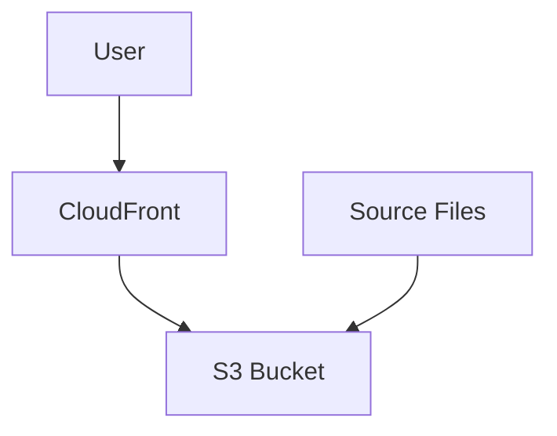
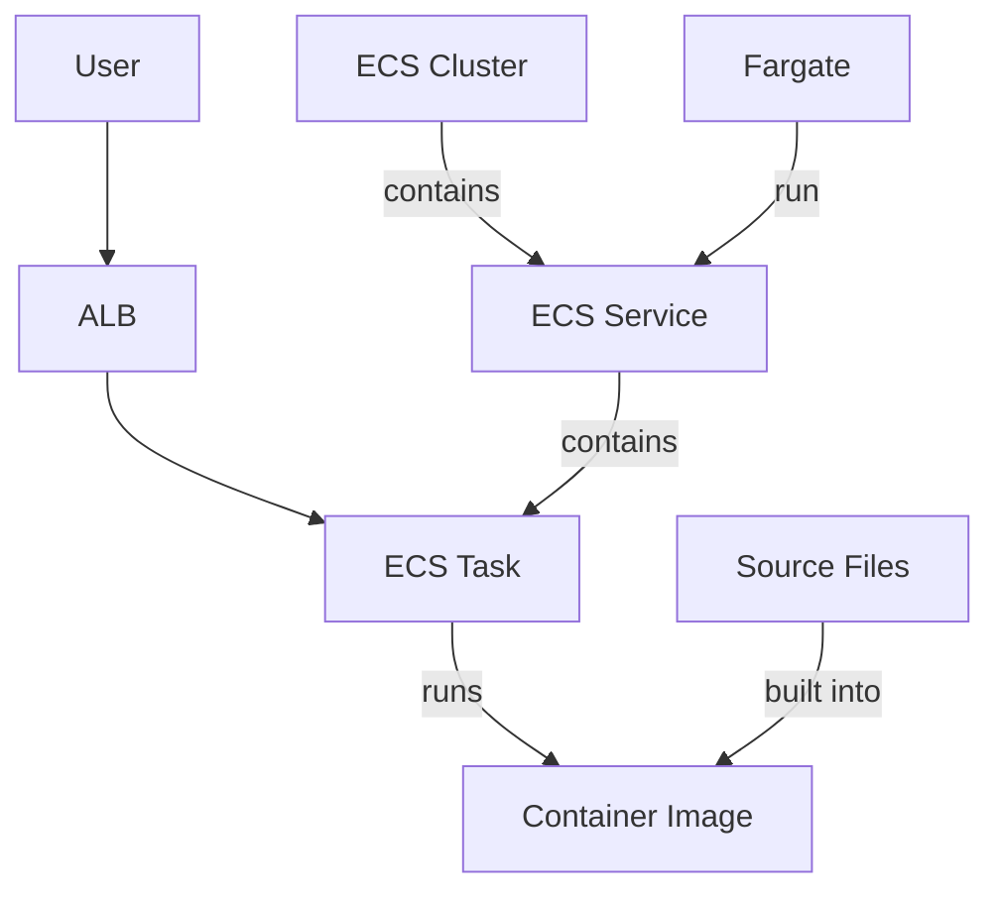

# Kosli Take-Home Test

Two different ways of serving a website are included here, using a Cloudfront distribution
in front of an S3 bucket, and an ALB in front of an ECS service.

The Cloudfront CDN option is ideal for static websites; low-latency, localised caching, and
easy to setup/administer.

The ALB-ECS option is more complex to setup, but allows the website to include dynamic
server-side logic, such as reading from a database, or presenting an API. Within this project
there is no server-side logic, it is a static website, however implemented this option to 
allow a comparision of the infrastructure required for the two approaches.

## Cloudfront

Within this solution, an S3 bucket is created per environment.  The terraform code uploads
the HTML and other files into the bucket.  A cloudfront distribution is configured with the
bucket as its one-and-only origin.

Using Terraform to upload the content is easy, but in a real-world environment I would prefer
to have the content uploaded from a CI/CD pipeline, instead.

## ECS

Within the ECS solution, the source files are built into a container image that is 
uploaded to an ECR.  I have reused the same ECR for all the logical environments - I
prefer a deployment model where there is an AWS account that holds all the images and
then each environment pulls from this central location.

The ECS Cluster contains a single service, which runs a task - multiple for test and production.
The task is configured to pull the image from the ECR

