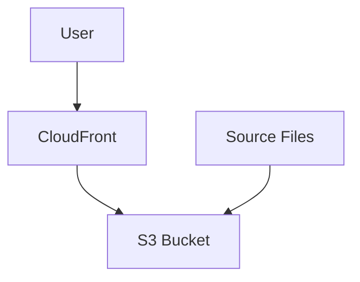
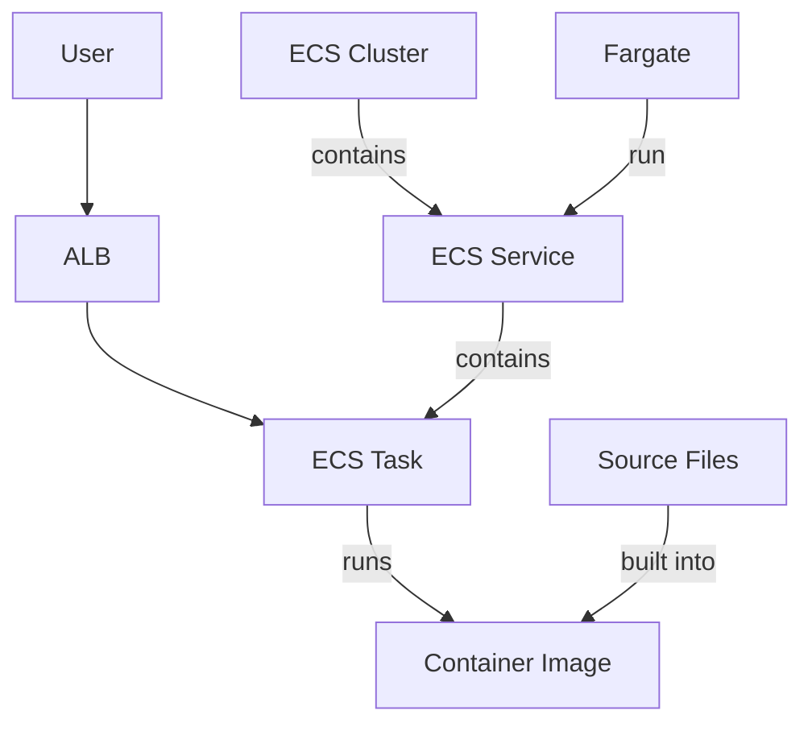

# Kosli Take-Home Test

Two different ways of serving a website are included here, using a Cloudfront distribution
in front of an S3 bucket, and an ALB in front of an ECS service.

The Cloudfront CDN option is ideal for static websites; low-latency, localised caching, and
easy to setup/administer.

The ALB-ECS option is more complex to setup, but allows the website to include dynamic
server-side logic, such as reading from a database, or presenting an API. Within this project
there is no server-side logic, it is a static website, however implemented this option to 
allow a comparision of the infrastructure required for the two approaches.

## Cloudfront

Within this solution, an S3 bucket is created per environment.  The terraform code uploads
the HTML and other files into the bucket.  A cloudfront distribution is configured with the
bucket as its one-and-only origin.

Using Terraform to upload the content is easy, but in a real-world environment I would prefer
to have the content uploaded from a CI/CD pipeline, instead.

| URL | Environment | Notes |
| --- | ----------- | ----- |
| http://dev-kosli-cf.grahamandsarah.com | Dev | Cloudfront distribution, plain-text |
| https://dev-kosli-cf.grahamandsarah.com | Dev | Cloudfront distribution, TLS |
| http://test-kosli-cf.grahamandsarah.com | Test | Cloudfront distribution, plain-text |
| https://test-kosli-cf.grahamandsarah.com | Test | Cloudfront distribution, TLS |

_Note: Some browsers will attempt to get the https version when you click the http link - e.g. Safari on MacOS_

## ECS

Within the ECS solution, the source files are built into a container image that is 
uploaded to an ECR.  I have reused the same ECR for all the logical environments - I
prefer a deployment model where there is an AWS account that holds all the images and
then each environment pulls from this central location.

The ECS Cluster contains a single service, which runs a task - multiple for test and production.
The task is configured to pull the image from the ECR

| URL | Environment | Notes |
| --- | ----------- | ----- |
| http://dev-kosli-app.grahamandsarah.com | Dev | ECS-deployed application, plain-text |
| https://dev-kosli-app.grahamandsarah.com | Dev | ECS-deployed application, TLS |
| http://test-kosli-app.grahamandsarah.com | Test | ECS-deployed application, plain-text |
| https://test-kosli-app.grahamandsarah.com | Test | ECS-deployed application, TLS |

_Note: Some browsers will attempt to get the https version when you click the http link - e.g. Safari on MacOS_

## Assessment Against Requirements

| Requirement | Assessment |
| ----------- | ---------- |
| You should provision all necessary infra using Terraform. | Yes, everything _except_ the wildcart TLS cert |
| You should not store Terraform state locally. Pick any supported backend. | State stored in S3 |
| Changes to HTML should cause redeployment. | This implies some sort of CI? Updating the HTML and running terraform apply would redeploy it.  In the ECS world it's a little more messy|
| DNS name or IP address should stay the same after redeployment | DNS supplied by the ALB and Cloudfront, so yes, they don't change.  CNAME in my personal domain points to the AWS domains |
| TLS is optional | TLS implemented.  It would be odd to put something online without it! |
| You should be able to deploy the same code into two different AWS accounts (think dev and prod). There should be a possibility to specify different parameters between accounts. For instance, the name of the ssh key if you are to go with EC2. | dev, test and production are configured.  The approach I've taken relies on having the right setup in your ~/.aws/config file. |
| Please store Terraform code on GitHub and share a link to the repo with us. | https://github.com/gsavage/kosli-homework |
| CI setup is optional. | I used terraform fmt and terraform validate as part of my local workflow, but yes, I didn't configure Github Actions for this repo |

## Points of interest

I'm very aware of the need to implement good security practises.  I've chosen to run the ECS
task in private subnets, I'm avoiding using the VPC Default security group.  I've used a private
S3 bucket with a restrictive policy.  All of these choices slowed down the implementation,
but this sort of thing, protecting our IP, is something that I feel very strongly about.

I haven't implemented them in Terraform here, but this account is my personal account and I do
have billing alerts setup. Please don't run siege or ab against these endpoints!  

I did not use GenAI to build any of this.  I did click the Amazon Q icon once to help diagnose
a problem pulling from an ECR, but all it did was point me at a page of documentation.

## Further Work

There are a number of opportunities to improve these implementations.

* Remove the upload HTML step from Terraform - deploying a website, to my mind, is an 
  operation that should be performed by a CI/CD tool outside of the Terraform code.
  I could imagine wanting to compile the HTML files using a tool like Jekyll and running
  that in a pipeline doesn't smell like it belongs here

* This repo contains two different mechanisms for serving a website.  I would prefer to 
  split them out into separate repositories; perhaps one for the Cloudfront, one for the ECS,
  one for the ECS _service_, and yet another for the HTML.  For the purposes of the homework
  assignment, that felt like overkill.

* I haven't implemented any monitoring or alerting.  I'm aware this wasn't mentioned in the
  requirements, so perhaps it's not something that if of interest, but I'm calling out that
  if this proof-of-concept went any further, or was available to real users, I would most
  definitely implement monitoring and alerting within Cloudwatch.

* I do not have a WAF in front of either the ALB or Cloudfront, again, this was for
  simplicity and to not stretch the brief too far.  There's no way I would put this into
  real production without those protections.

* I've used no-ff merges so you can see how this has evolved, if you want to review the 
  commit history.  This isn't how I prefer to work - I love rebase-onto-main and merge-ff 
  however I know a lot of people like this merge bubbles, so I've left them in to help 
  the reviewer.

